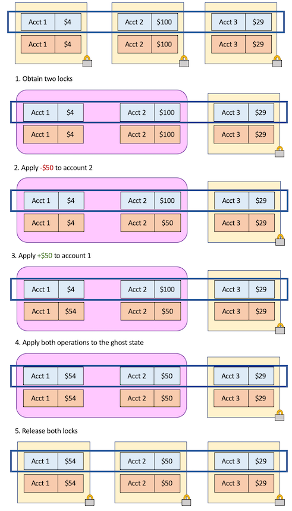

Here, we will explain how to use a Sharded State Machine (SSM) to assist in our concurrent implementation.

The idea is that we will make the SSM available to the implementation as _ghost state_.
The implementation will be allowed to manipulate ghost _tokens_ that represent shards of
the state. Again, these 'ghost tokens' do not really exist and will not exist in a compiled
binary.  However, for the purpose of verification, we imagine that these tokens are there.

Our system architecture will use the Mutexes from [MutexIntro.md](MutexIntro.md).
We will store one account and its balance behind each mutex. 
Furthermore, each mutex will store this balance bost _physically_ and _ghostily_.

This diagram illustrates the architecture (we show only 3 accounts for simplicity):

Each yellow box indicates a mutex. The blue boxes represent the ghost state,
while the orange boxes represent physical state.

There are two notions of an “invariant” here:

 * Each mutex establishes an invariant between the physical state and the ghost state (stating that the account ID and amount of money match)
 * The ghost state are tokens representing shards of a state machine. They are governed by the state machine protocol, and are therefore subject to the invariant of that protocol (represented by the long blue box).

Now, a program can execute a transition with the following steps (say, we want to move
$50 from account 2 to account 1).

1. Acquire the locks on accounts 1 and 2. In doing so, acquire the invariants between the ghost state and the physical state.
2. Subtract $50 from account 2.
3. Add $50 to account 1.
4. Perform the same transfer on the ghost state (subtract $50 from account 2, and add $50 to account 1). Since we are operating on ghost state here, this can be done atomically. Furthermore, this operation corresponds to a sharded transition, as defined on the previous
page.
5. Release both locks. Note that the mutex invariants have been restored, so we can do
the release.

Here are the above steps, presented graphically (the purple box represents thread-owned state):

