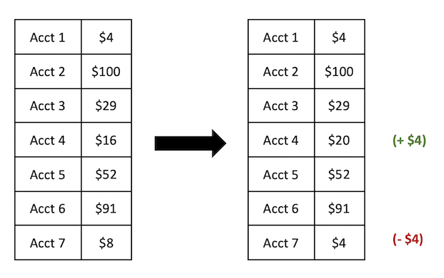

Let's introduce a toy example for a case study: the concurrent **Bank** application.

The bank application will maintain some number of accounts.
We will allow one kind of operation: a _transfer_ operation, which moves money from one account to another.
Ideally, these operations could happen concurrently, and we will demand that they be linearizable.



We won't allow deposits or withdrawals, only transfers, so the total amount of money in the bank
should be conserved. In the example, the total amount of money will be fixed at $300.

For maximum throughput, we'd like to maintain the account balances using a fine-grained locking strategy:
we'd like to protect each single account behind a different lock. So, to perform a transfer,
we would end up taking two locks, moving the money, then releasing the locks.

Now, let's suppose we want to prove the following property:

_Maximum Balance Property:_
If we take the locks on any number of account and observe their balances,
their sum should be at most $300.

Intuitively, we should be able to reason out this property as follows:
any time we do a transfer, we preserve the total amount of money. The total
amount of money is $300, and nobody has a negative balance.

Yet, it's not immediately clear how we would formalize this in a proof.
After all, using the mutex library we explored in the previous section,
there is no way to establish an invariant across multiple mutexes. There's no
way to express the invariant that the sum of all accounts is $300 (not unless
we put all accounts behind a single mutex).

Before we answer this question, let's briefly review state machines.

Let's make a simple state machine to model the bank, and prove an invariant about it
(that the total amount of money is conserved). For simplicity, we will also assume
a fixed number of accounts.

[code/Bank_StateMachine.dfy](code/Bank_StateMachine.dfy)
```dafny
module MathUtils {
  /*
   * Inductively define the sum of a sequence of integers
   */
  function sum(numbers: seq<nat>) : nat
  {
    if |numbers| == 0 then
      0
    else
      sum(numbers[.. |numbers| - 1]) + numbers[|numbers| - 1]
  }

  /*
   * Utility lemma for showing that sum is preserved when
   * two number of a sequence change.
   */
  lemma sum_is_preserved_on_transfer(numbers: seq<nat>, numbers': seq<nat>, i: nat, j: nat)
  requires |numbers| == |numbers'|
  requires 0 <= i < |numbers|
  requires 0 <= j < |numbers|
  requires i != j
  requires numbers[i] + numbers[j] == numbers'[i] + numbers'[j]
  requires forall k | 0 <= k < |numbers| && k != i && k != j
        :: numbers[k] == numbers'[k]
  ensures sum(numbers) == sum(numbers')
  {
    // excercise: fill in the proof
  }
}

module Bank {
  import MathUtils

  /*
   * Honestly, I don't know much about banking.
   * I doubt I'll get more than 7 customers.
   */
  const NumberOfAccounts := 7;

  const FixedTotalMoney := 300;

  /*
   * Declare the state variable for the state machine
   * representing our bank application.
   */
  datatype Variables = Variables(account_balances: seq<nat>)

  /*
   * Declare our target invariant.
   */
  predicate Inv(s: Variables)
  {
    && |s.account_balances| == NumberOfAccounts    
    && MathUtils.sum(s.account_balances) == FixedTotalMoney
  }

  /*
   * Our one allowed operation will be to transfer money
   * from one account to another.
   */

  datatype AccountTransfer = AccountTransfer(
      source_account: nat,
      dest_account: nat,
      money: nat)

  predicate Transfer(s: Variables, s': Variables, transfer: AccountTransfer)
  {
    // Check that the source account and destination account aren't the same,
    // check that account numbers are valid
    && transfer.source_account != transfer.dest_account
    && 0 <= transfer.source_account < |s.account_balances|
    && 0 <= transfer.dest_account < |s.account_balances|

    // Make sure the source account has enough money to cover the transaction.
    && transfer.money <= s.account_balances[transfer.source_account]

    // Simple balance transfer
    && s' == Variables(
      s.account_balances
        [transfer.source_account := s.account_balances[transfer.source_account] - transfer.money]
        [transfer.dest_account   := s.account_balances[transfer.dest_account] + transfer.money]
      )
  }

  /*
   * Show that the operation preserves the state machine invariant.
   */

  lemma TransferPreservesInv(s: Variables, s': Variables, transfer: AccountTransfer)
  requires Inv(s)
  requires Transfer(s, s', transfer)
  ensures Inv(s')
  {
    // Show that the total amount of money is preserved when we subtract some
    // amount from one balance and add it to another balance.

    MathUtils.sum_is_preserved_on_transfer(
        s.account_balances, s'.account_balances,
        transfer.source_account, transfer.dest_account);
  }
}
```

Of course, modeling the bank as a ‘monolithic’ state machine like this won't be helpful for the fine-grained implementation we want.
