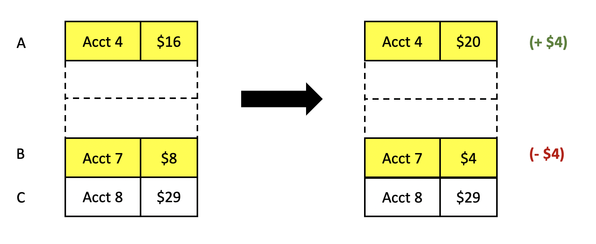

From the earlier sections, we should now be familiar with the concept that in concurrent verification, we often have some _ghost state_, and we tie that ghost state to physical memory somehow.

Furthermore, many applications will share memory in a read-only fashion (e.g., via a reader-writer lock). It stands to reason, then, that we may want to share ghost state in a similar way.

Linear dafny has a concept of `shared` to go along with its `linear`. It's best to think of `shared` as being like a shared (i.e., not-mut) borrow `&` in Rust; Dafny has very simple rules—much simpler and less powerful than Rust's borrow checker—but the principle is the same. In either case, there are rules that let you turn a `linear` (exclusively owned) object into a `shared` (shared borrow) object, and they make sure that these `shared` objects expire before exclusive access is regained to the original.

Likewise, `glinear` has a corresponding concept of `gshared`. So how does this work?

Let's return to our “bank” example. Let's suppose that instead of our normal transfer
operation, we want to implement a transfer operation that has to check some other condition.
Say, for example, we want to transfer money to account A from account B, but only if
some other account C has >= $10 in it. We don't need to modify this account C, but do we need to check its balance, so a programmer may want to use a reader-writer lock. The transfer operation would open accounts A and B's locks in write (exclusive) mode, and account C in read (shared) mode.

(Okay, yeah, so this bank example is a little forced. A more complicated example might be a hash table, where inserts and updates are done with exclusive locks and queries are done with shared locks. Still, I want something simple, and the bank example will illustrate the ideas.)

If we return to the sharded state machine that represents the bank application, a transition on a shard will now require _three_ bank accounts. However, only two of them are actually modified (highlighted in yellow here):



We already know that we can perform this transition on ghost shard state if we have `glinear` access to this three-account shard.

However, it stands to reason that we should still be allowed to perform this transition even if we have accounts A and B in `glinear` form and account C in `gshared` form.

In fact, our framework lets us do exactly that. The more interesting question becomes how to get this `gshared` in the first place.

We want to be able to somehow get a `gshared` object out of a reader-writer lock when we acquire the lock in shared mode. Of course, we need to ensure that all these `gshared` objects expire by the time the shared lock is released.

(Note: for simplicity, we're going to assume the RwLock only protects ghost state.
If the client wants to protect physical state, they can store a `PointsTo` object in the lock.)

We can do something similar to the way [Rust's RwLock](https://doc.rust-lang.org/std/sync/struct.RwLock.html) works. When you call `read()` on an `RwLock`, you get back a `RwLockReadGuard<T>` object, which you have exclusive access to. Furthermore, you can obtain a borrow of your `T` object from the guard object. Of course, this borrow must expired before you return the guard object.

We'll do exactly the same thing. Our equivalent of `RwLockReadGuard` will be the `SharedHandle`. (Generally, I find shared/exclusive terminology to be a little clearer than read/write.)
A RwLock spec is in [code/RwLock.dfy](code/RwLock.dfy). It's a lot like the previous `Mutex`. Here are the new bits:

```dafny
datatype SharedHandle<V> = MutexHandle(m: Mutex<V>, v: V)

type {:extern} Mutex(==)<V>
{
  /*
   * `acquire_shared`
   * Like acquire, but can be held by more than one client at a time.
   * Returns a handle that can be borrowed from 
   */

  method acquire_shared()
  returns (glinear handle: SharedHandle<V>)
  ensures this.inv(handle.v)
  ensures handle.m == this

  /*
   * `acquire_release`
   */

  method release_shared(glinear handle: SharedHandle<V>)
  requires handle.m == this
}

function method {:extern} borrow_shared<V>(gshared handle: SharedHandle<V>)
    : (gshared v: V)
ensures v == handle.v
```

`acquire_shared` gives you access to the `SharedHandle<V>` object.
Furthermore, you can use the `borrow_shared` function to borrow a `gshared V` version of
the object from the `SharedHandle<V>`, and you can use that to perform operations like
the bank operation above, or if `V` represents access to memory, then you can read that
memory but not write to it.

Finally, to release the shared lock, you return the `SharedHandle<V>` to the RwLock.
