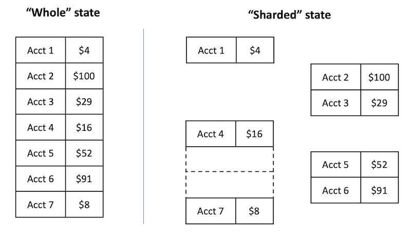
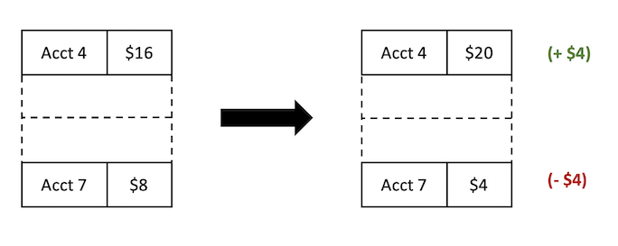

In order to support a fine-grained locking strategy, we need something other than the monolithic state machine from the previous page.

Thus we will define a sharded state machine, a state machine with an explicit notion of being able to split it into pieces.

For example, in our bank application, we can imagine that the array of accounts could be broken into shards, with different accounts in different shards.



(Note that the “shards” don’t have to be contiguous in the sense of the array structure—the sequential nature of the array is unimportant. For example, one of the shards in the picture above has accounts 4 and 7.)

When we define state transitions on this state machine, we will define the transitions on the shards. For example, consider the ‘transfer’ operation: it only needs access to two of the accounts to perform its operation. Therefore, we can define the operation on a shard with only 2 accounts in it:



Defining transitions on shards gives rise to a state machine on the “complete” state:


This is essentially the same state machine we saw on the last page, and we can use all of our usual tricks to deal with this state machine.

In order to construct a sharded state machine for the bank application, we need to first formalize the notion of ‘sharding.’ The main feature of a sharded state machine is the compositional structure, i.e., given two (or more) shards, we should be able to “glue” them together into a bigger shard. This enables the state machine to have a notion both of the small shards and of the complete state.

It turns out the general algebraic structure for a sharded state machine is a Partial Commutative Monoid (PCM). (https://en.wikipedia.org/wiki/Monoid) PCMs have been known to be useful in concurrent verification for a while. Formally, a PCM is:

- A set M, with a binary operator x · y (the “gluing operation”)
    - · is commutative (i.e., x · y = y · x)
    - · is associative (i.e., (x · y) · z = x · (y · z))
    - · may be partial (x · y may be undefined)

Why do we want these properties?

- Associativity & commutativity: when we “glue” two shards together, it should be symmetric; there’s no sense in which one comes before the other. (Analogy: say you have a jigsaw puzzle. No matter which order you snap the pieces together, you’ll get the same picture in the end.)
- Partiality: it’s possible to have two shards that are incompatible with each other. In this case, composing them simply gives ‘undefined,’ often written bottom (⊥). For example, in the bank application, suppose we had two different shards that both claimed to have ‘account 0’. It would be impossible to compose them. (That’s not to say it’s never possible to have a situation where two monoids “overlap” somehow, but in the bank application, at least, a shard represents exclusive access to the accounts it contains.)

Let’s be a little more concrete and actually define a shard type for the bank state machine. A given shard is going to have some account IDs and balances in it.
So a reasonable shard type would be something like `map<AccountId, Money>`. Again, our gluing operation is going to be partial - to handle this, we'll
create a single invalid element, which we'll just call Invalid.

(Strictly speaking, we're defining a total monoid and then declaring one element to be the "invalid" state.)

```dafny
type AccountId = nat 
type Money = nat 

datatype Shard =
| Shard(account_balances: map<AccountId, Money>)
| Invalid

predicate valid_shard(a: Shard)
{
  a != Invalid
}
```

The gluing operation · is essentially going to be disjoint union. Of course, before doing the union, we have to check disjointness.

```dafny
predicate maps_overlap(a: map<AccountId, Money>, b: map<AccountId, Money>)
{
  exists account_id :: account_id in a && account_id in b
}

function union_maps(a: map<AccountId, Money>, b: map<AccountId, Money>) : map<AccountId, Money>
{
  map account_id | account_id in (a.Keys + b.Keys)
    :: (if account_id in a.Keys then a[account_id] else b[account_id])
}

function glue(a: Shard, b: Shard) : Shard
{
  if a == Invalid || b == Invalid then
    Invalid
  else if maps_overlap(a.account_balances, b.account_balances) then
    Invalid
  else
    Shard(union_maps(a.account_balances, b.account_balances))
}
```

We can prove commutativity and associativity within Dafny. Dafny only need a little help with the proofs.

```dafny
lemma glue_commutative(a: Shard, b: Shard)
ensures glue(a, b) == glue(b, a)
{
  if glue(a, b) != Invalid {
    var x := glue(a, b).account_balances;
    var y := glue(b, a).account_balances;
    assert x == y by {
      assert forall id | id in x :: x[id] == y[id];
    }
  }
}

lemma glue_associative(a: Shard, b: Shard, c: Shard)
ensures glue(glue(a, b), c) == glue(a, glue(b, c))
{
  if glue(glue(a, b), c) != Invalid {
    var x := glue(glue(a, b), c).account_balances;
    var y := glue(a, glue(b, c)).account_balances;
    assert x == y by {
      assert forall id | id in x :: x[id] == y[id];
    }
  }
}
```

Now, we can go ahead and define an invariant on our state. Note that while `valid_shard` is a predicate for _any_ valid shard, the `Inv` is meant
to be a 'global' property, an invariant over the 'complete' shard, all the shards glued together.

Our invariant is still declared over the Shard type, though,
so one of our invariant properties will actually just be a predicate stating that the shard is whole (contains all the account IDs).
But again, our main invariant of interest will be the fact that the total amount of money is some fixed amount.

```dafny
/*
 * Declare our target invariant.
 * The invariant is meant to hold on a 'whole' shard,
 * that is, all the pieces glued together at once.
 */

predicate ShardHasAllAccounts(accounts: map<AccountId, Money>)
{
  forall i | 0 <= i < NumberOfAccounts :: i in accounts
}

function MapToSeq(accounts: map<AccountId, Money>) : seq<nat>
requires ShardHasAllAccounts(accounts)
{
  seq(NumberOfAccounts, (i) requires 0 <= i < NumberOfAccounts => accounts[i])
}

predicate Inv(s: Shard)
{
  && s != Invalid
  && ShardHasAllAccounts(s.account_balances)
  && MathUtils.sum(MapToSeq(s.account_balances)) == FixedTotalMoney
}
```

Next, let's declare our 'transfer' operation like we did before.

```dafny
predicate Transfer(shard: Shard, shard': Shard, transfer: AccountTransfer)
{
  // Naturally, we won't allow an operation on invalid states.
  && shard != Invalid
  && shard' != Invalid

  // Check that the source account and destination account aren't the same,
  // check that account numbers are valid
  && transfer.source_account != transfer.dest_account
  && 0 <= transfer.source_account < NumberOfAccounts
  && 0 <= transfer.dest_account < NumberOfAccounts

  // Check that the shard we're operating on actually has the two accounts
  // we care about. (It could have more as well, those don't matter, but we
  // definitely need these two.)
  && transfer.source_account in shard.account_balances
  && transfer.dest_account in shard.account_balances

  // Make sure the source account has enough money to cover the transaction.
  && transfer.money <= shard.account_balances[transfer.source_account]

  // Simple balance transfer
  && shard' == Shard(
    shard.account_balances
      [transfer.source_account := shard.account_balances[transfer.source_account] - transfer.money]
      [transfer.dest_account   := shard.account_balances[transfer.dest_account] + transfer.money]
    )
}
```

Just as we normally need to show that every transition preserves an invariant,
we need to show that a transition preserves the `valid_shard` predicate. This turns
out to be pretty easy, since our `valid_shard` predicate was very simple.

```dafny
lemma TransferPreservesValid(s: Shard, s': Shard, transfer: AccountTransfer)
requires valid_shard(s)
requires Transfer(s, s', transfer)
ensures valid_shard(s')
{
}
```

We also need to show that our state transition _respects composition_.
What this means is that if a shard _a_ can transition to a shard _b_,
then if we attach some unrelated piece _c_, then _a_ · _c_ should transition to _b_ · _c_.
Again, we can prove this in Dafny:

```dafny
lemma TransferAdditive(s: Shard, s': Shard, transfer: AccountTransfer, t: Shard)
requires Transfer(s, s', transfer)
requires valid_shard(glue(s, t))
requires Transfer(glue(s, t), glue(s', t), transfer)
{
}
```

Why is this important? Well, it's basically this lemma that tells us that the transitions
defined on small shards actually correspond to transitions on the global state.

And speaking of the global state,
we finally, we have our usual invariant preservation lemma.

```dafny
lemma TransferPreservesInv(s: Shard, s': Shard, transfer: AccountTransfer)
requires Inv(s)
requires Transfer(s, s', transfer)
ensures Inv(s')
{
  // Show that the total amount of money is preserved when we subtract some
  // amount from one balance and add it to another balance.

  MathUtils.sum_is_preserved_on_transfer(
      MapToSeq(s.account_balances),
      MapToSeq(s'.account_balances),
      transfer.source_account, transfer.dest_account);
}
```

See [code/Bank_ShardedStateMachine.dfy](code/Bank_ShardedStateMachine.dfy) for the full example.

And that's it, that's a sharded state machine!
On the next page, we'll learn how this sharded state machine can help us build a verified implementation with mutexes.
